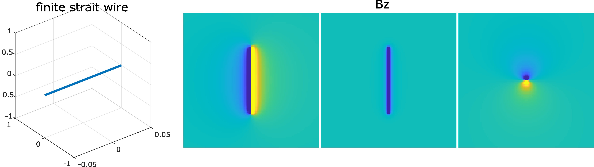
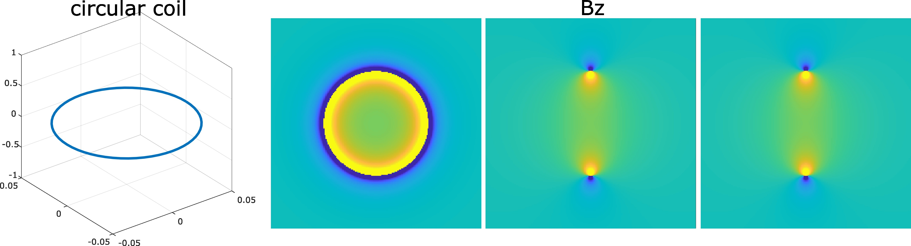

# Magnetic Field Calculator with Biot-Savart Law

[](https://github.com/aghaeifar/Biot-Savart/releases)


This software computes the magnetic field of a coil with an arbitrary shape using the Biot-Savart law. The coil may consist of one or multiple distinct segments. The program employs the analytical solution suggested in [this source](https://physics.stackexchange.com/questions/662024/) to determine the magnetic field generated by a finite thin wire. Input and output units adhere to the International System of Units (SI), "meter" for spatial positions and "tesla" for magnetic field.

Calculation is parallelized over given spatial points. Parallelization is implemented based on STL algorithms. Using a compiler with **C++17** support is required.

### Python interface:
Simply use cmake to compile program as a shared libary. See python example below.

### MATLAB interface: 
Program can be compiled as mex file without any change. see below.


## Installation:

### Linux dependencies:

```sh
sudo apt-get install g++ cmake git libtbb-dev
```
### Build shared library
Clone Biot-Savart simulator from repository:

```sh
git clone https://github.com/aghaeifar/Biot-Savart.git
```

Build and install Bloch simulator as a shared library:

```sh
$ cd Biot-Savart
$ cmake -B ./build
$ cmake --build ./build --config Release
```

### Build MATLAB mex  
#### Linux
```sh
mex biot_savart.cpp  -lm -ldl -ltbb -R2018a CXXFLAGS="\$CXXFLAGS -std=c++17"
```
#### Windows
```sh
mex biot_savart.cpp  -R2018a COMPFLAGS="$COMPFLAGS /std:c++17"
```

My test environment: Ubuntu 22.04 with g++ 11.4 + Windows 11 with MATLAB R2023a and Microsoft Visual C++ 2022.

## Example:
### MATLAB

```matlab
N = 100;
rng = linspace(-0.1, 0.1, N);
[x, y, z] = ndgrid(rng, rng, rng);
xyz = [x(:), y(:), z(:)]';  % in the form of 3xN, where N is number of spatial points

start = [-0.05, 0, 0]'; % in the form of 3xL, where L is number of segments
stop  = [0.05, 0, 0]';  % in the form of 3xL

B = biot_savart(start, stop, xyz); % B is in the form of 3xN

% show z component of magnetic field from a strait line 
Bz = reshape(B(3,:), size(x));
tiledlayout('horizontal', 'TileSpacing','tight','Padding', 'tight'); nexttile;
plot3([start(1), stop(1)], [start(2), stop(2)], [start(3), stop(3)], 'LineWidth', 3); grid on; nexttile;
imagesc(squeeze(Bz(:,:,N/2))); clim([-.3e-4, 0.3e-4]); axis image; axis off; nexttile;
imagesc(squeeze(Bz(:,N/2,:))); clim([-.3e-4, 0.3e-4]); axis image; axis off; nexttile;
imagesc(squeeze(Bz(N/2,:,:))); clim([-.3e-4, 0.3e-4]); axis image; axis off; 
```


```matlab
N = 200;
rng = linspace(-0.1, 0.1, N);
[x, y, z] = ndgrid(rng, rng, rng);
xyz = [x(:), y(:), z(:)]';  % in the form of 3xN, where N is number of spatial points

L = 60;
radius = 0.05;
theta  = linspace(0, 2*pi, L+1)';
segments = radius * [cos(theta), sin(theta), zeros(L+1,1)]'; % in the form of 3xL, where L is number of segments
start = segments(:, 1:end-1);  % in the form of 3xL
stop  = segments(:, 2:end);  % in the form of 3xL

B = biot_savart(start, stop, xyz); % B is in the form of 3xN

% show z component of magnetic field from a circular coil
Bz = reshape(B(3,:), size(x));
tiledlayout('horizontal', 'TileSpacing','tight','Padding', 'tight'); nexttile;
plot3(segments(1,:), segments(2,:), segments(3,:), 'LineWidth', 3); grid on; nexttile;
imagesc(squeeze(Bz(:,:,N/2))); clim([-.4e-4, 0.4e-4]); axis image; axis off; nexttile;
imagesc(squeeze(Bz(:,N/2,:))); clim([-.4e-4, 0.4e-4]); axis image; axis off; nexttile;
imagesc(squeeze(Bz(N/2,:,:))); clim([-.4e-4, 0.4e-4]); axis image; axis off; 
```


### Python
To do...

## Contributing:

Pull requests are welcome. For major changes, please open an issue first to discuss what you would like to change.
